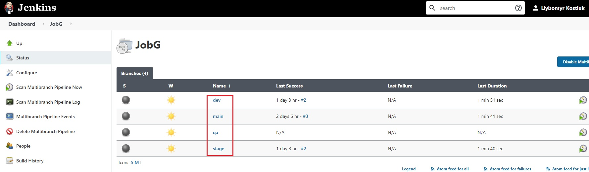

# Experience with Jenkins

## 1. Installation and expoloring Jenkins

### 1.1 Simple job that lists all environment variables from the host machine


### 1.2 Simple job using Shell that outputs system uptime, OS version, Kernel version etc


### 1.3 Simple job that triggers after previous job runs successfully and prints build number variable


## 2. Plugins, folders, users, bulding, testing, pushing

### 2.1 Installation the following plugins

-
  - [Folders](https://plugins.jenkins.io/cloudbees-folder)
  - [Workspace cleanup](https://plugins.jenkins.io/ws-cleanup)
  - [Build timeout](https://plugins.jenkins.io/build-timeout)
  - [Git](https://plugins.jenkins.io/git/)
  - [Maven integration](https://plugins.jenkins.io/maven-plugin/)
  - [Artifactory](https://plugins.jenkins.io/artifactory/)
  - [Credentials Binding](https://plugins.jenkins.io/credentials-binding/)

### 2.2 Via Jenkins cli command


### 2.3 Manually via jenkins plugin manager


### 2.4 Jenkins job(Job A) that clones PetClinic and runing unit tests


### 2.5 Jenkins job(Job B) that clones PetClinic and packages it and pushes to AWS S3


### 2.6 Created folder "training_2" and  moved job B inside it, created user "builder" and allow them to Read, Build, Cancel jobs inside the folder


## 3. Parameterization

### 3.1 Cloned Petclinic project to main branch and created three branches: qa, stage, dev


### 3.2 Created parameterized Job E that builds Petclinic project from branches: qa, stage, dev that should be used as parameters


### 3.3 Created Jenkins agent using SSH Build Agents plugin


### 3.4 Created a dynamic agent using AWS Lambda Cloud Plugin and AWS lambda jenkins agent (NOT WORKING!!!!)

### Build and deploy AWS lambda jenkins agent


### Configuring AWS Lambda Cloud


### AWS lambda Agent not launching


## 4. Pipelines

### 4.1 Created declarative pipeline as Job F that contains the steps from Job A and Job B

```Declarative pipeline
pipeline {
    agent {
    label 'jenslave'
    }
    tools {
          maven "maven"
    }
    stages {
        stage('Build') {
            steps {
                checkout([$class: 'GitSCM', branches: [[name: '*/main']],
                 doGenerateSubmoduleConfigurations: false, 
                 extensions: [], 
                 submoduleCfg: [], 
                 userRemoteConfigs: [[url: 'https://github.com/lubomiro/petclinic.git']]])
                script {
                env.COMMITTER = sh(script:'git log -n 1 --pretty=format:"%an"', returnStdout: true).trim()
                env.EMAIL = sh(script:'git log -n 1 --pretty=format:"%ae"', returnStdout: true).trim()
                }
                sh "mvn -Dmaven.test.failure.ignore=true clean package"
            }
        }
        stage('Test') {
            steps {
                junit '**/target/surefire-reports/TEST-*.xml'
                archiveArtifacts 'target/*.jar'
            }
        }
        stage('Deploy to AWS S3') {
            steps {
                s3Upload consoleLogLevel: 'INFO', 
                        dontSetBuildResultOnFailure: false, 
                        dontWaitForConcurrentBuildCompletion: false, 
                        entries: [[bucket: 'mybuilds/${JOB_NAME}-${BUILD_NUMBER}', 
                        excludedFile: '', 
                        flatten: false, 
                        gzipFiles: false, 
                        keepForever: false, 
                        managedArtifacts: false, 
                        noUploadOnFailure: true, 
                        selectedRegion: 'eu-central-1', 
                        showDirectlyInBrowser: false, 
                        sourceFile: 'target/*.jar', 
                        storageClass: 'STANDARD', 
                        uploadFromSlave: true, 
                        useServerSideEncryption: false]], 
                        pluginFailureResultConstraint: 'FAILURE', 
                        profileName: 'petclinic-bucket', 
                        userMetadata: []
            }
            post{
                always{
                    echo "Name of the committer ${env.COMMITTER}"
                    echo "Email of the committer ${env.EMAIL}"
                }
            }
        }
    }
}
```

### 4.2 Poll SCM every 3 minutes


### 4.3 SCM pooling with a webhook


### 4.4 Pipeline trigger only if a specific branch and specific files were updated


```Generic Webhook Trigger
triggers {
  GenericTrigger( causeString: 'Generic Cause', 
  genericVariables: [[defaultValue: '', key: 'ref', regexpFilter: '', value: '$.ref'], 
  [defaultValue: '', key: 'changed_files', regexpFilter: '', value: '$.commits[*].[\'modified\',\'added\',\'removed\'][*]']], 
  regexpFilterExpression: 'refs/heads/stage .*readme.md.*', 
  regexpFilterText: '$ref $changed_files', 
  token: 'lubomir', 
  tokenCredentialId: ''
  )
}
```

### 4.5 Multi-branch pipeline



### 4.6 Pipeline with parameters

```Pipeline with parameters
pipeline {
  agent any
  parameters {
  string(name: 'OWNER', defaultValue: 'Libomyr', description: 'Project owner')
  choice(name: 'BRANCH', choices: ['main', 'qa', 'dev', 'stage'], description: 'choice branch')
  text(name: 'INFO', defaultValue: 'Its very simple project with parametrs', description: 'Information about project')
}
    stages {
        stage('Hello') {
            steps {
                git branch: '${BRANCH}', url: 'https://github.com/lubomiro/petclinic.git'
                echo "Build branch ${BRANCH}"
                echo "Owner project ${OWNER}"
                echo "Information about this project: ${INFO}"
            }
        }
    }
}
```


