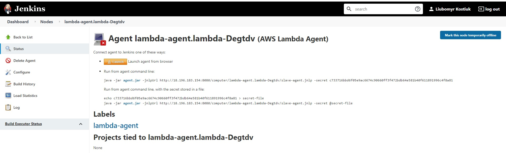

# Some hands-on experience with Jenkins

## 1. Installation and expoloring Jenkins

### 1.1 Simple job  that lists all environment variables from the host machine

### 1.2 Simple job using Shell that outputs system uptime, OS version, Kernel version etc

### 1.3 Simple job that triggers after previous job runs successfully. Prints build number variable

## 2. Plugins, folders, users, bulding, testing, pushing

### 2.1 Installed the following plugins:
 -
    - [Folders](https://plugins.jenkins.io/cloudbees-folder)
    - [Workspace cleanup](https://plugins.jenkins.io/ws-cleanup)
    - [Build timeout](https://plugins.jenkins.io/build-timeout)
    - [Git](https://plugins.jenkins.io/git/)
    - [Maven integration](https://plugins.jenkins.io/maven-plugin/)
    - [Artifactory](https://plugins.jenkins.io/artifactory/)
    - [Credentials Binding](https://plugins.jenkins.io/credentials-binding/)

### 2.2 Via Jenkins cli command

### 2.3 Manually via jenkins plugin manager

### 2.4 Jenkins job(Job A) that clones PetClinic and runing unit tests.

### 2.5 Jenkins job(Job B) that clones PetClinic and packages it and pushes to AWS S3

### 2.6 Created "training_2" folder and  moved job B inside it and created user "builder" and allow them to Read, Build, Cancel jobs inside the folder

## 3. Parameterization
### 3.1 Cloned Petclinic to main branch, created three branches: qa, stage, dev

### 3.2 Created parameterized Job E that builds Petclinic project from branches: qa, stage, dev that should be used as parameters.

### 3.3 Created Jenkins agent using SSH Build Agents plugin

- 

3.4 Created a dynamic agent using AWS Lambda Cloud Plugin and AWS lambda jenkins agent
 Builded and deoloyed AWS lambda jenkins agent     Cofigured AWS AWS Lambda Cloud    AWS lambda Agent not lunch   

## 4. Pipelines

- Create __Job F__ as declarative pipeline that contains the steps from __Job A__ and __Job B__. Use Petclinic source from _master_ branch of your repo.
- Create _Jenkinsfile_ from __Job F__ pipeline and push it to _master_ branch in your repo.
- Update __Job F__ to use Jenkinsfile from your repo.
- Update __Job F__ to poll SCM every 2-3 minutes to run job if changes appers. Make test commit to _master_ branch and check if __Job F__ started automatically.
- 

Optional task
 Substitute the SCM pooling with a webhook   

Very optional task
 

We're serious, it's really very optional
  A few option here, make the pipeline trigger only if a specific branch was updated. The next level is to make the pipeline trigger only if a specific branch and specific files were updated. Keep in mind, that initially you can do it with a simple job, and then later codify it in a pipeline. Perhaps the snippet generator can help as well     
 
 

- Inside of any **stage**, find the email or name of the committer, set it as a Jenkins variable. And later, just echo inside the **post** block. Later the idea might be developed into sth more, but now just to practice it.
- Create __Job G__ as multi-branch pipeline based on __Job F__.
  - https://www.jenkins.io/doc/book/pipeline/multibranch/
  - https://plugins.jenkins.io/workflow-multibranch/
- Create pipeline __Job H__ with a few parameters. The pipeline should print the values to the std out.
- Create pipeline __Job I__ that will trigger __Job H__ with some specific parameters.

